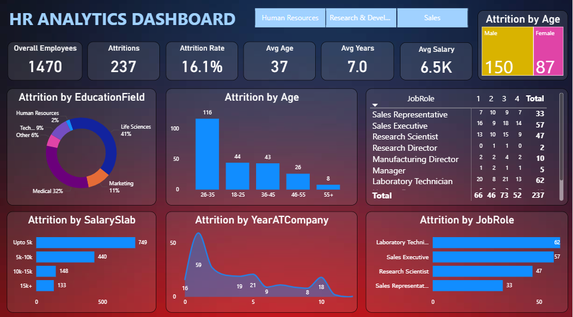

# 📊 HR Analytics Dashboard – Employee Attrition (Power BI)



---

## 📌 Project Overview
This repository contains an **HR Analytics Dashboard** built using **Power BI** to analyze and monitor employee attrition. It provides insights into workforce demographics, attrition trends, and the factors contributing to employee turnover.

The dashboard enables HR and management teams to identify high-risk areas and make data-driven decisions to improve employee retention.

---

## 🎯 Objectives
- Track **overall attrition rate** and **employee count**.
- Understand attrition patterns based on **age**, **salary slabs**, **education fields**, **years at company**, and **job roles**.
- Compare **male vs female attrition**.
- Provide an interactive experience for HR, R&D, and Sales departments.

---

## 🧮 Key Metrics in the Dashboard

| Metric                | Description |
|-----------------------|-------------|
| **Overall Employees** | Total number of employees (1470) |
| **Attritions**        | Total number of employees who left (237) |
| **Attrition Rate**    | Percentage of attrition (16.1%) |
| **Avg Age**           | Average employee age (37 years) |
| **Avg Years**         | Average tenure (7 years) |
| **Avg Salary**        | Average salary (6.5K) |

---

## 📈 Visuals Included

### 1. Attrition by Education Field (Donut Chart)
- Segments: Life Sciences, Medical, Marketing, Technical, Human Resources, and Others.
- Helps identify which educational backgrounds have higher attrition.

### 2. Attrition by Age (Bar Chart)
- Categories: 18–25, 26–35, 36–45, 46–55, 55+.
- Shows that the highest attrition occurs between **26–35** years.

### 3. Attrition by Salary Slab (Bar Chart)
- Salary ranges: Upto 5K, 5K–10K, 10K–15K, 15K+.
- Indicates attrition patterns by pay scale.

### 4. Attrition by Year at Company (Area Chart)
- Years at company vs attrition count.
- Peaks at employees with **1 year of experience**.

### 5. Attrition by Job Role (Horizontal Bar Chart)
- Compares attrition count across job roles.
- Laboratory Technician, Sales Executive, and Research Scientist show highest attrition.

### 6. Attrition by Gender (Card & Bar)
- Male = 150, Female = 87.
- Helps see the gender distribution of attrition.

### 7. JobRole Table
- Attrition count breakdown by job role and department.

---

## 🎚️ Filters and Slicers
- **Department Tabs**: HR, Research & Development, Sales.
- **Interactive slicers** to filter data by age, job role, salary, and years at company.

---

## 🗂️ Data Sources
The `.pbit` file allows you to connect to your own HR dataset. Typically, you need a dataset with the following fields:

| Column Name        | Description |
|-------------------|-------------|
| EmployeeID        | Unique employee ID |
| Age               | Age of employee |
| Gender            | Male/Female |
| EducationField    | Education background |
| JobRole           | Current job role |
| Department        | HR/R&D/Sales |
| MonthlyIncome     | Salary |
| YearsAtCompany    | Tenure |
| Attrition         | Yes/No |

---

## ⚙️ How to Use This Dashboard

### Step 1: Download and Open
- Download the file **`DASHBOARD FOR HR.pbit`**.
- Open it with **Power BI Desktop**.

### Step 2: Connect to Your Data Source
- When prompted, provide the location of your HR dataset (Excel, CSV, or database).
- Map the fields accordingly.

### Step 3: Refresh Data
- Click **Refresh** in Power BI to load the data into the dashboard visuals.

### Step 4: Interact with Filters
- Use slicers to filter by Department, Job Role, Age, or Salary Slab.

---

## 🛠️ Technical Details
- **Software**: Power BI Desktop (latest version recommended).
- **File Type**: `.pbit` (Power BI template file).
- **Data Model**: Contains prebuilt measures and visuals (DAX measures for Attrition Rate, Average Age, etc.).
- **Custom Visuals**: Standard Power BI visuals (bar chart, donut chart, card visuals, and line chart).

---

## 🧑‍💻 Example DAX Measures

```DAX
-- Attrition Count
Attrition Count = CALCULATE(COUNTROWS(EmployeeData), EmployeeData[Attrition] = "Yes")

-- Attrition Rate
Attrition Rate = DIVIDE([Attrition Count], COUNTROWS(EmployeeData), 0)

-- Average Age
Average Age = AVERAGE(EmployeeData[Age])

-- Average Salary
Average Salary = AVERAGE(EmployeeData[MonthlyIncome])

-- Average Years at Company
Average Years = AVERAGE(EmployeeData[YearsAtCompany])
